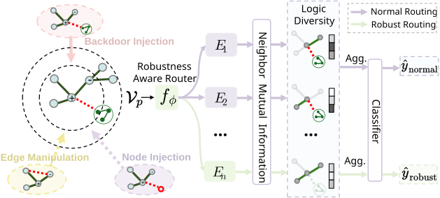

# RGMoE

A scalable, robust Graph Mixture-of-Experts (MoE) framework with **logic diversity** and a **robustness-aware router** for defending against **backdoor**, **edge manipulation**, and **node injection** attacks.

## 0) Framework



## 1) Setup

### 1.1 Clone & Enter
```
git clone https://anonymous.4open.science/r/RGMoE-F870.git
cd RGMoE
```
### 1.2 Environment
```
conda create -n rgmoe python=3.10 -y
conda activate rgmoe
pip install -r requirements.txt
```

## 2) Generate Attacked Graphs
We provide scripts for three attack families. Each script will write attacked graphs to its subfolder (adjust output paths and dataset names in the scripts if needed).


### 2.1 Backdoor - UGBA
```
bash backdoor/scripts/train_UGBA.sh
```

### 2.2 Edge manipulation — PRBCD
```
bash manipulation/scripts/train_prbcd.sh
```

### 2.3 Node injection — TDGIA
```
bash node_injection/scripts/train_tdgia.sh
```

## 3) Train RGMoE
Use the MoE training scripts per threat model. Please tune --w_div (logic-diversity loss weight) and --topk (active experts per node) to balance robustness and performance.

### 3.1 Backdoor setting
```
bash backdoor/scripts/train_moe.sh
```
### 3.2 Edge manipulation setting
```
bash manipulation/scripts/train_moe.sh
```

### 3.3 Node injection setting
```
bash node_injection/scripts/train_moe.sh 
```
